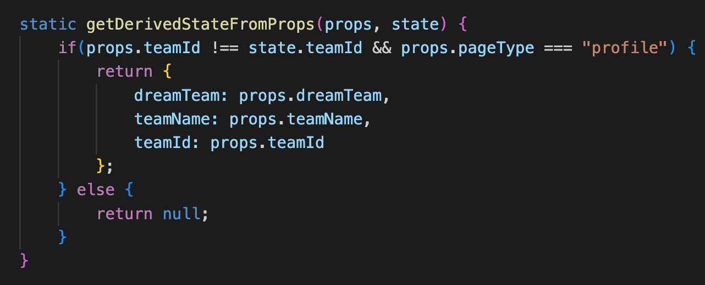
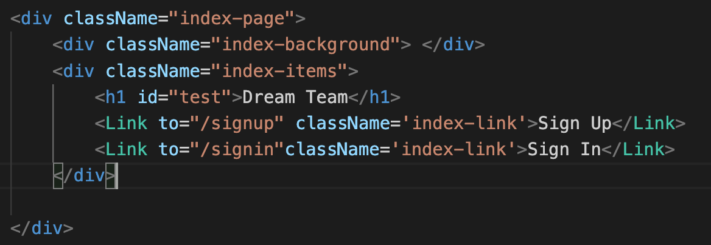
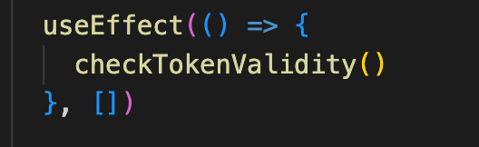

  

# Create your own dream teams ⚽️ :soccer:

## Deployment

This app is available [here](https://radiant-kataifi-c4ad61.netlify.app). 

Sign up using an email address and a 6 digit+ password is required.

## Description

With over 3000 football players available from 90 football clubs around Europe, pick your own custom dream teams and show them to your friends and fellow football fans!

## Getting Started/Code Installation
All code is available in the main branch. To install the code, follow the steps below:
1. Fork and clone the repo
2. `cd` into the repo on the CLI
3. Run `npm install` inside the repo
4. Run `npm start` - app should open on localhost:3001
5. Ensure the backend is running using the steps [here](https://github.com/justinpjtate1/dream_team_backend)

## Timeframe

This was a solo project. Initially this took 5 days to complete, with 1 day later that was spent refactoring to simplify the initial build.

**Day 1** Planning - more on that below. This time was spent wireframing, making an erd diagram, working out what technologies to use and understanding where to get the seed data from.

**Day 2** I spent building the backend. The main pieces were authentication using devise, building the tables and building the routes, more details on the build process for the backend in the [repo](https://github.com/justinpjtate1/dream_team_backend).

**Day 3** The morning was spent building the backend futher, before moving onto the frontend in the afternoon. Firstly, I worked on the sign up/sign in pages and authentication with devise in the backend. After that, my focus was on the 'Create Dream Team' page.

**Day 4** Finished the 'Create Dream Team' page and then moved on to the 'View all' and 'Profile' pages. I knew there'd be similar components used here.

**Day 5** Finished the React components for these pages and worked on CSS styling.

**Day 6** Refactoring to make the app straightforward and easy for future improvments

## Technologies Used
- React.js
- REST API
- WireframePro
- Node Package Manager
- Netlify
- Backend technologies [here](https://github.com/justinpjtate1/dream_team_backend)

## Planning
- I had 2 different plans: An [MVP](./public/MVP%20Project.pdf) plan and an [ambitious](./public/Ambitious%20Project%204.pdf) plan. The main difference between the 2 is that in the MVP, I descoped the ability to comment on other users' teams. This a feature that would be developed in the future.

- In the MVP plan, I sketched out 6 pages. I knew I'd need a landing page, separate sign-up and sign-in pages, a profile page, a create page and a view all page. Essentially I wanted the user to be able to add, modify and delete their own teams and also have the ability to view other users'. Some small features were missed (for example, the delete account functionality and the reset team functionality) but I felt like an MVP could be achieved without these features.

- I had some [user stories](./public/Project%204%20user%20stories.pdf). Most were achieved, but some were descoped as they didn't feel completely necessary for the MVP

- I also had an ERD, and this can be found in the backend [ReadMe](https://github.com/justinpjtate1/dream_team_backend)

## Build/Code Process

Some of the pieces of code I would highlight:

1. The use of the getDerviedStateFromProps():

    I use same component in the create team section and the profile section. It's the EditTeamContainer component. This component renders the pitch component and the search player component, it also has some functions and states, one of the states in particular (`dreamTeam`) is an object that contains the list of players to render on the pitch component. 
    
    The issue I had using this component on the profile section was that I would want to select a team to edit and pass that team as an object to the `dreamTeam` state. This was an object that was passed down as a prop and I initally set the state `dreamTeam` to the prop if it existed, or a blank object if not. I ran into issues when I wanted to edit a second team, because although a different object was being passed into the props, the state wasn't updating to the new prop, which meant the team that was first selected was always the one getting updated. Using getDerviedStateFromProps() allowed me to update the team info in the `dreamTeam` state and allow the user to edit the correct team when making edits to multiple teams.

2. Fading the background on the initial landing page:

    For the user experience, I wanted to fade the background image of the landing page to make the sign in and sign up buttons more prominent and more obvious to use. I experimented with a couple of different options before getting to my solution:
    - Firstly, I added an opacity to the whole component, which also meant that although the background faded, so did the buttons, and that was not the desired outcome.
    - Secondly, I tried uploading the background image inside a regular image element instead. I then moved the Z-index to a negative value and made the image really large. I could then fade the image element directly without having the buttons faded. I felt like although this solution worked, it didn't look so good when the window was resized.
    - Finally I realised I should make a div element that spans the whole of the area I wanted to cover with the background image and add the background image to that div tag. In the CSS, I added the opacity so the background image faded, I also set the background image to cover the screen, so I didn't have the issues with the sizing as before. I then had to add a separate div with the buttons inside them. As I was trying to cover the whole page with the other div, I first realised these were rendering below the initial view height. To change this, I added some CSS to the div that contained the buttons and set an absolute position with a higher z-index. I don't feel like this would have worked out well for pages with lots of different elements, but felt like it was the solution I was looking for with a page of this size.

3. The use of useEffect():

    Although useEffect() is commonly used, in the classes I took, we mostly learnt React.js using class components, so I've had limited experience with functional components and React Hooks. I used useState before, but it was good to learn another hook and use it effectively. In my code, I use it at the app level to check if the user's login token is still valid, and determines whether the user should be logged in or not.

## Challenges

The main challenge was refactoring the code so the component usage was simplified. Previously I had a lot of logic in some of the child components and this didn't make a lot of sense upon reflection. I think I could have split some of the child components up further and not relied on so much logic in child components to render what I needed. The aim of refactoring was to simplify the component usage as much as possible.

## Wins
Fixing some of the bugs outlined above and some of the code refactoring. In it's current state, I haven't detected any functionality that doesn't function as expected and I can add more functionality.

## Key Learnings
- Keep a lot of the logic in higher components where possible.
- Re-using components where possible, even if a bit of conditional rendering was needed.
- Finding more ways to manage states as outlined above.

## Future Improvements
- Allowing users to select different formations - the refactoring here would also make the code a bit cleaner (especially for the pitch component).
- Allowing users to comment on each other's teams
- Styling improvements
- User voting
- More players included
